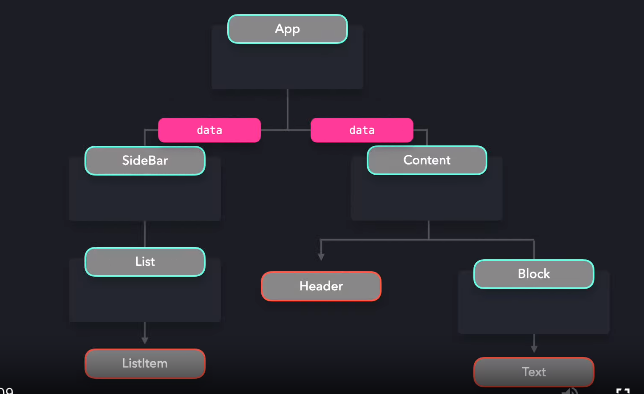

# 프로바이더 패턴

- 다수의 자식 컴포넌트가 데이터를 공유할 수 있게 함
- 전역 상태를 공유하는데 매우 유용

## 1. props로 데이터를 자식 컴포넌트에 전달하는 기존 구조의 문제

- props를 통해 모든 컴포넌트가 같은 데이터를 참조할 수 있게 하는 것은 어렵다
  - `props drilling`을 유발할 수 있으며 이는 리팩토링 및 데이터의 출처를 파악하기 힘들게 만든다

예시 이미지



코드 예시

```js
function App() {
  const data = { ... }

  return (
    <div>
      <SideBar data={data} />
      <Content data={data} />
    </div>
  )
}

const SideBar = ({ data }) => <List data={data} />
const List = ({ data }) => <ListItem data={data} />
const ListItem = ({ data }) => <span>{data.listItem}</span>

const Content = ({ data }) => (
  <div>
    <Header data={data} />
    <Block data={data} />
  </div>
)
const Header = ({ data }) => <div>{data.title}</div>
const Block = ({ data }) => <Text data={data} />
const Text = ({ data }) => <h1>{data.text}</h1>
```

- 데이터를 사용하지 않는 컴포넌트 레이어도 props로 data를 가져야 하는 문제가 있다
- provider 패턴을 사용하여 하위 레이어에 props를 전달하는 대신 모든 컴포넌트를 provider로 래핑할 수 있다

## 2. Context API를 활용한 Provider 패턴

- Provider : Context 객체가 제공하는 HOC(high order component)
- createContext 메서드를 사용하여 Context 객체 생성 가능
- Provider 컴포넌트는 value props를 받기 때문에 여기에 전달할 data를 부여하면 된다

```js
const DataContext = React.createContext()

function App() {
  const data = { ... }

  return (
    <div>
      <DataContext.Provider value={data}>
        <SideBar />
        <Content />
      </DataContext.Provider>
    </div>
  )
}
```

- 이제 자식 컴포넌트들은 data에 접근할 수 있다
- useContext 훅을 사용하여 데이터를 전달받는다
  - useContext 훅에 context 객체를 전달하면 전역 상태를 컴포넌트에서 읽고 쓸 수 있다

```js
const DataContext = React.createContext();

function App() {
  const data = { ... }

  return (
    <div>
      <SideBar />
      <Content />
    </div>
  )
}

const SideBar = () => <List />
const List = () => <ListItem />
const Content = () => <div><Header /><Block /></div>


function ListItem() {
  const { data } = React.useContext(DataContext);
  return <span>{data.listItem}</span>;
}

function Text() {
  const { data } = React.useContext(DataContext);
  return <h1>{data.text}</h1>;
}

function Header() {
  const { data } = React.useContext(DataContext);
  return <div>{data.title}</div>;
}
```

## 3. 다크모드 구현하기
- Context API 활용
- 모든 컴포넌트에 현재 theme 데이터를 전달하는 대신, ThemeProvider 컴포넌트로 theme이 필요한 컴포넌트들을 래핑한다

`Provider.jsx`

## 4. 케이스 스터디
### 예시: Styled-components
- Provider 패턴을 적용한 대표적인 라이브러리로 Styled-components를 꼽을 수 있다
- ThemeProvider API를 통해 Context API를 사용하지 않고도 theme 객체를 전역에서 참조할 수 있다

App.jsx : ThemeProvider API 활용
```js
import { ThemeProvider } from "styled-components";
 
export default function App() {
  const [theme, setTheme] = useState("dark");
 
  function toggleTheme() {
    setTheme(theme === "light" ? "dark" : "light");
  }
 
  return (
    <div className={`App theme-${theme}`}>
      <ThemeProvider theme={themes[theme]}>
        <Toggle toggleTheme={toggleTheme} />
        <List />
      </ThemeProvider>
    </div>
  );
}
```

ListItem.jsx : theme 객체를 활용해 스타일 작성

```js
import styled from "styled-components";
 
export default function ListItem() {
  return (
    <Li>
      Lorem ipsum dolor sit amet, consectetur adipiscing elit, sed do eiusmod
      tempor incididunt ut labore et dolore magna aliqua. Ut enim ad minim
      veniam, quis nostrud exercitation ullamco laboris nisi ut aliquip ex ea
      commodo consequat.
    </Li>
  );
}
 
const Li = styled.li`
  ${({ theme }) => `
     background-color: ${theme.backgroundColor};
     color: ${theme.color};
  `}
`;

```
## 5. 트레이드 오프
### 장점
- 각 컴포넌트 레이어에 props로 데이터를 일일이 전달할 필요가 없어져 버그를 줄일 수 있다
- 즉, 안티 패턴은 props drilling 제거 가능

### 단점
- 동일한 컨텍스트 객체를 소비하는 경우, 컨텍스트 객체의 데이터가 바뀔 때마다 이를 소비하는 모든 컴포넌트가 리렌더링된다
- 이는 대규모 애플리케이션에서 성능 문제를 야기할 수 있다
- 이를 막기 위해서는 여러 프로바이더를 만들어야 한다

참고

https://www.patterns.dev/posts/provider-pattern
